# Architectuur Documentatie

## Inleiding

Dit document beschrijft de volledige architectuur van de Elections-applicatie. De applicatie is een fullstack web-applicatie voor het analyseren en interactief werken met Nederlandse verkiezingsgegevens.

---

## Architectuur Overzicht

De applicatie volgt een **klassieke 3-tier architectuur** met een duidelijke scheiding tussen frontend, backend en database.

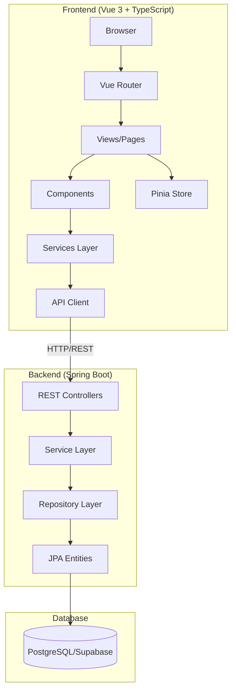

---

## High-Level Systeem Diagram

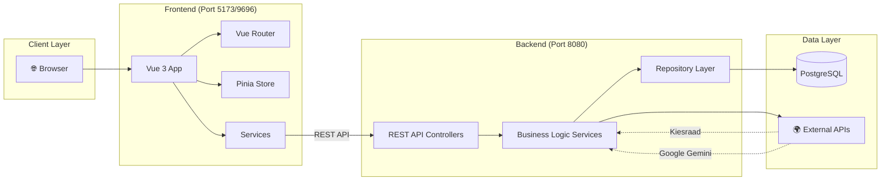

---

## Backend Architectuur

### Layered Architecture Pattern

De backend volgt het **Layered Architecture Pattern** met vier duidelijk gescheiden lagen:

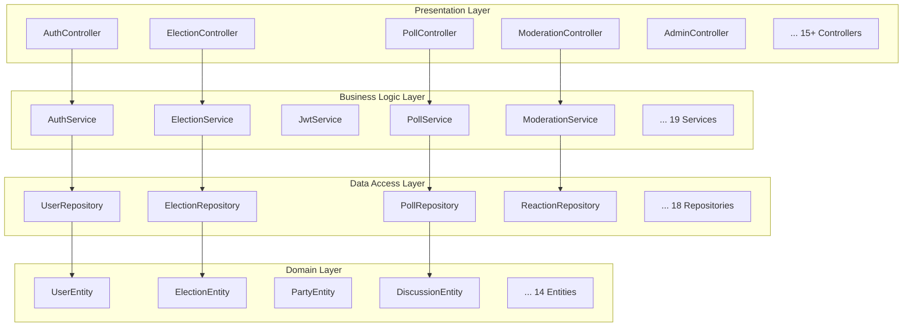

### Package Structuur

```
nl.hva.election_backend/
├── ElectionBackendApplication.java      # Spring Boot entry point
├── api/
│   └── DebugController.java             # Debug endpoints
├── controller/                          # REST Controllers
│   ├── AuthController.java
│   ├── AdminController.java
│   ├── AdminModerationController.java
│   ├── AdminPollController.java
│   ├── ElectionController.java
│   ├── ModerationController.java
│   ├── MunicipalityController.java
│   ├── PollController.java
│   ├── StatementController.java
│   ├── UserController.java
│   ├── VotingGuideAnswersController.java
│   ├── VotingGuidePartyController.java
│   ├── VotingGuideResultsController.java
│   └── parser/                          # XML Parsing Controllers
│       ├── CandidateController.java
│       ├── ConstituencyController.java
│       ├── DiscussionController.java
│       ├── ParserElectionController.java
│       └── PartyController.java
├── service/                             # Business Logic
│   ├── AdminService.java
│   ├── AuthService.java
│   ├── ConstituencyService.java
│   ├── DiscussionService.java
│   ├── DutchElectionService.java
│   ├── ElectionService.java
│   ├── JwtService.java
│   ├── ModerationLogService.java
│   ├── ModerationService.java
│   ├── MunicipalityService.java
│   ├── PartyService.java
│   ├── PartyViewpointService.java
│   ├── PollService.java
│   ├── ProfanityService.java
│   ├── ReactionService.java
│   ├── StatementService.java
│   ├── VotingGuideAnswersService.java
│   ├── VotingGuidePartyService.java
│   └── VotingGuideResultsService.java
├── repository/                          # Data Access
│   ├── ConstituencyRepository.java
│   ├── ConstituencyResultRepository.java
│   ├── DiscussionRepository.java
│   ├── ElectionRepository.java
│   ├── MunicipalityRepository.java
│   ├── MunicipalityResultRepository.java
│   ├── PartyRepository.java
│   ├── PartyViewpointRepository.java
│   ├── PollRepository.java
│   ├── PollVoteRepository.java
│   ├── ReactionRepository.java
│   ├── RefreshTokenRepository.java
│   ├── StatementRepository.java
│   ├── UserRepository.java
│   ├── VotingGuideAnswerRepository.java
│   ├── VotingGuidePartyRepository.java
│   └── VotingGuideResultsRepository.java
├── entity/                              # JPA Entities
│   ├── ConstituencyEntity.java
│   ├── ConstituencyResultEntity.java
│   ├── DiscussionEntity.java
│   ├── ElectionEntity.java
│   ├── MunicipalityEntity.java
│   ├── MunicipalityResultEntity.java
│   ├── PartyEntity.java
│   ├── PartyViewpointEntity.java
│   ├── ReactionEntity.java
│   ├── StatementEntity.java
│   ├── UserEntity.java
│   ├── VotingGuideAnswerEntity.java
│   ├── VotingGuidePartyEntity.java
│   ├── VotingGuideResultEntity.java
│   └── id/                              # Composite Key Classes
│       ├── PartyId.java
│       ├── ConstituencyId.java
│       └── MunicipalityResultId.java
└── dto/                                 # Data Transfer Objects
    ├── AuthenticationResponse.java
    ├── DiscussionDetailDto.java
    ├── DiscussionListItemDto.java
    ├── LoginRequest.java
    ├── LoginResponse.java
    ├── ModerationResponse.java
    ├── ModerationResult.java
    ├── MunicipalityDto.java
    ├── PartyResultDto.java
    ├── PollOverviewDto.java
    ├── PollResult.java
    ├── ReactionDto.java
    ├── RegisterRequest.java
    ├── RegisterResponse.java
    ├── TextRequest.java
    ├── TokenRefreshResponse.java
    ├── UpdateUserRequest.java
    └── VotingGuide*Dto.java
```

---

## Entity Class Diagrams

### Core Domain Model

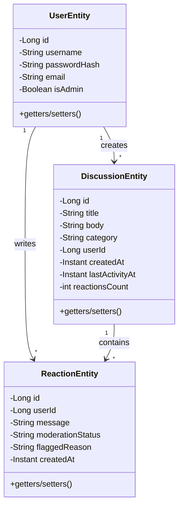

### Election Domain Model

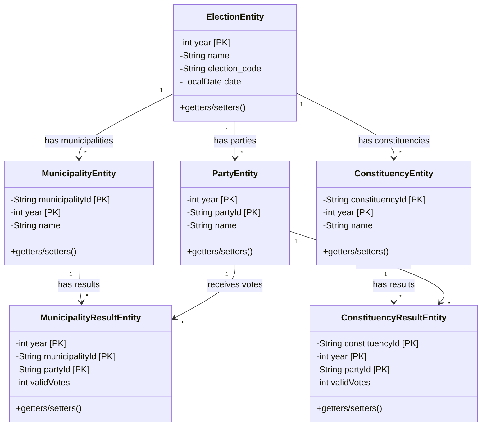

### Voting Guide Domain Model

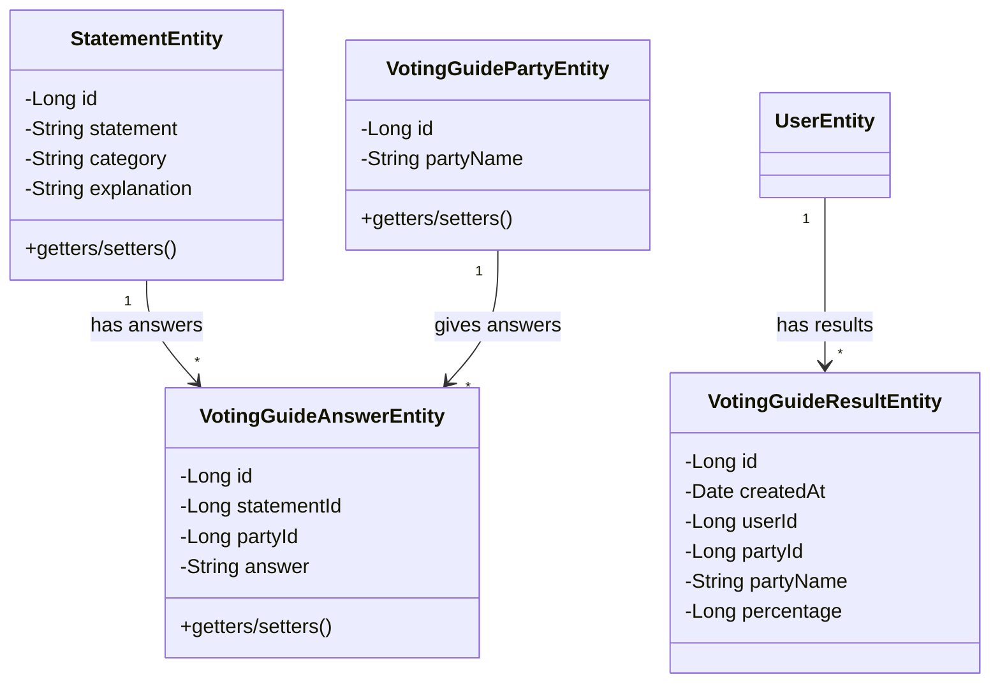

---

## Database Schema (ERD)

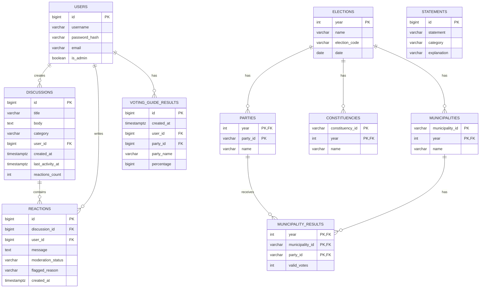

---

## Frontend Architectuur

### Component Hiërarchie

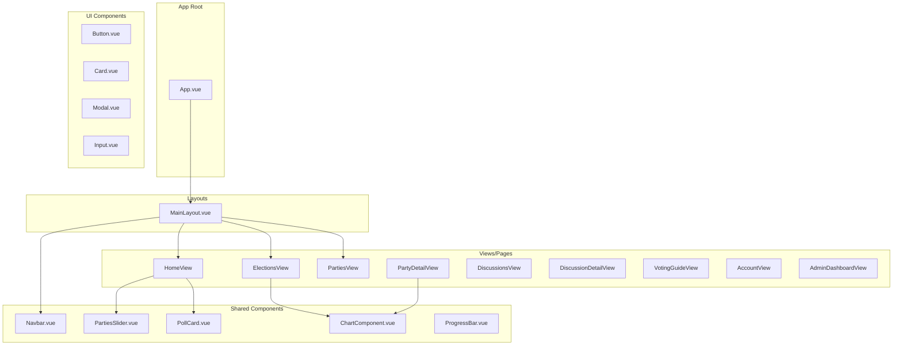

### Frontend Package Structuur

```
election-frontend/src/
├── App.vue                              # Root component
├── main.ts                              # Entry point
├── apiClient.ts                         # Custom fetch wrapper met JWT refresh
├── router/
│   └── index.ts                         # Vue Router configuratie
├── store/
│   └── authStore.ts                     # Authenticatie state (Pinia-like)
├── services/                            # API Service Layer
│   ├── AdminService.ts
│   ├── AuthService.ts
│   ├── ElectionService.ts
│   ├── ModerationService.ts
│   ├── PartyService.ts
│   ├── PollService.ts
│   ├── StatementService.ts
│   ├── UserService.ts
│   ├── VotingGuideAnswersService.ts
│   ├── VotingGuidePartiesService.ts
│   ├── VotingGuideResultsService.ts
│   └── WikipediaService.ts
├── views/                               # Page Components
│   ├── HomeView.vue
│   ├── LoginView.vue
│   ├── RegisterView.vue
│   ├── ElectionsView.vue
│   ├── PartiesView.vue
│   ├── PartyDetailView.vue
│   ├── DiscussionsView.vue
│   ├── DiscussionDetailView.vue
│   ├── VotingGuideHomeView.vue
│   ├── VotingGuideView.vue
│   ├── VotingGuideResultsView.vue
│   ├── ElectionCalenderView.vue
│   ├── AccountView.vue
│   └── admin/
│       ├── AdminDashboardView.vue
│       ├── AdminModerationView.vue
│       └── AdminPollsView.vue
├── components/
│   ├── Navbar.vue
│   ├── PartiesSlider.vue
│   ├── ChartComponent.vue
│   ├── PollCard.vue
│   ├── ProgressBar.vue
│   ├── AdminMenu.vue
│   ├── CustomToolTip.vue
│   ├── icons/                           # Icon components
│   ├── maps/                            # Map components
│   └── ui/                              # Reusable UI primitives
│       ├── Button.vue
│       ├── Card.vue
│       ├── Input.vue
│       └── ... (27 components)
├── layouts/
│   └── MainLayout.vue
├── types/
│   └── api.ts                           # TypeScript type definities
├── lib/
│   └── utils.ts                         # Utility functions
└── assets/
    └── ... (CSS, images)
```

### State Management Flow

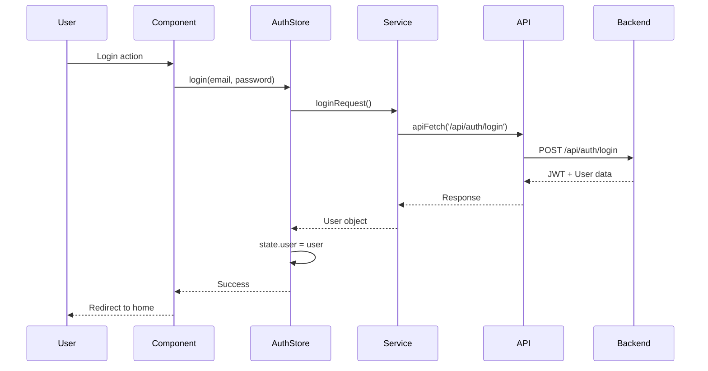

---

## Authenticatie Architectuur

### JWT Token Flow

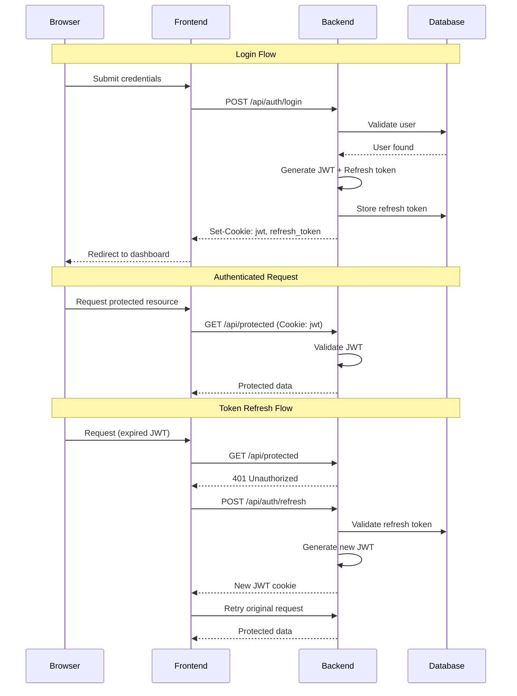

---

## Data Flow Architectuur

### Verkiezingsdata Import Flow

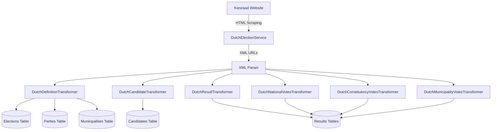

### Content Moderation Flow

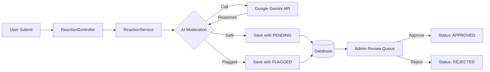

---

## API Endpoints Overzicht

### Authentication Endpoints
| Method | Endpoint | Beschrijving |
|--------|----------|--------------|
| POST | `/api/auth/login` | Gebruiker inloggen |
| POST | `/api/auth/register` | Nieuwe gebruiker registreren |
| POST | `/api/auth/refresh` | Access token vernieuwen |
| DELETE | `/api/auth/logout` | Uitloggen |
| GET | `/api/auth/session` | Huidige sessie ophalen |

### Election Data Endpoints
| Method | Endpoint | Beschrijving |
|--------|----------|--------------|
| GET | `/api/elections` | Alle verkiezingen |
| GET | `/api/elections/{year}` | Specifieke verkiezing |
| GET | `/api/parties` | Alle partijen |
| GET | `/api/parties/{id}` | Specifieke partij |
| GET | `/api/municipalities` | Alle gemeenten |
| GET | `/api/constituencies` | Alle kieskringen |

### Discussion/Forum Endpoints
| Method | Endpoint | Beschrijving |
|--------|----------|--------------|
| GET | `/api/discussions` | Alle discussies |
| GET | `/api/discussions/{id}` | Specifieke discussie |
| POST | `/api/discussions` | Nieuwe discussie |
| POST | `/api/discussions/{id}/reactions` | Reactie toevoegen |

### Voting Guide Endpoints
| Method | Endpoint | Beschrijving |
|--------|----------|--------------|
| GET | `/api/statements` | Alle stemwijzer stellingen |
| GET | `/api/voting-guide/parties` | Partijen voor stemwijzer |
| POST | `/api/voting-guide/results` | Stemwijzer resultaat opslaan |
| GET | `/api/voting-guide/results/{userId}` | Resultaten ophalen |

### Admin Endpoints
| Method | Endpoint | Beschrijving |
|--------|----------|--------------|
| GET | `/api/admin/moderation/pending` | Pending moderaties |
| POST | `/api/admin/moderation/{id}/approve` | Reactie goedkeuren |
| POST | `/api/admin/moderation/{id}/reject` | Reactie afwijzen |
| POST | `/api/admin/polls` | Nieuwe poll aanmaken |

---

## Deployment Architectuur

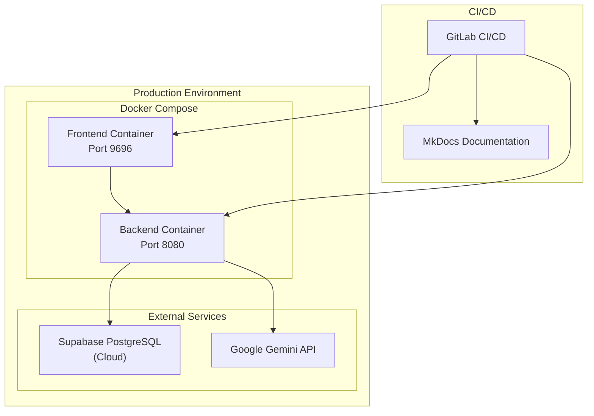

---

## Componenten Samenvatting

| Component | Technologie | Verantwoordelijkheid |
|-----------|-------------|----------------------|
| **Frontend** | Vue 3, TypeScript, Vite | User interface, routing, state management |
| **Backend** | Spring Boot 3.5.5, Java 21 | REST API, business logic, data access |
| **Database** | PostgreSQL (Supabase) | Persistent data storage |
| **Auth** | JWT + BCrypt | Stateless authentication |
| **AI Moderation** | Google Gemini | Content filtering |
| **Styling** | TailwindCSS, PrimeVue | UI components en design |
| **Maps** | Leaflet | Geografische visualisaties |
| **Charts** | Chart.js, Unovis | Data visualisaties |

---

## Key Design Patterns Gebruikt

1. **Layered Architecture** - Backend scheiding in Controller/Service/Repository/Entity
2. **Repository Pattern** - Data access abstractie via Spring Data JPA
3. **DTO Pattern** - Entities gescheiden van API responses
4. **Composite Key Pattern** - Election data met samengestelde sleutels
5. **Composable Pattern** - Vue 3 Composition API voor herbruikbare logica
6. **Service Layer Pattern** - Frontend services voor API communicatie
7. **Route Guards** - Vue Router authenticatie checks
8. **Token Refresh Pattern** - Automatische JWT verversing

---

> **Zie ook:**
> - [Design Decisions](design-decisions.md) - Gedetailleerde uitleg van alle architectuurbeslissingen
> - [Tech Stack](tech-stack.md) - Overzicht van alle gebruikte technologieën
> - [Deployment](deployment.md) - Deployment instructies
