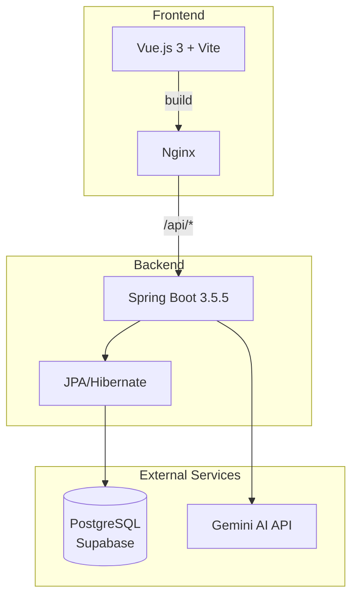

# Deployment Documentatie

Dit document beschrijft hoe je de Elections applicatie kunt deployen. De applicatie bestaat uit een **Spring Boot backend** en een **Vue.js frontend**.

---

## Overzicht Architectuur



---

## Deployment Opties

| Methode | Gebruik | Complexiteit |
|---------|---------|--------------|
| [Docker Compose](#docker-compose-aanbevolen) | Productie & Staging | Laag |
| [Handmatig](#handmatige-deployment) | Development | Gemiddeld |
| [GitLab CI/CD](#gitlab-cicd) | Automatische deployment |  Geavanceerd |

---

## Vereisten

### Systeemvereisten

| Component | Minimale Versie | Aanbevolen |
|-----------|-----------------|------------|
| **Java** | 21 | 21 LTS |
| **Node.js** | 20.19.0 | 22.12.0+ |
| **Maven** | 3.9.x | 3.9.4 |
| **Docker** | 20.10+ | 24.0+ |
| **Docker Compose** | 2.20+ | 2.24+ |

### Externe Services

- **PostgreSQL Database** (momenteel via Supabase)
- **Gemini AI API key** (optioneel, voor AI features)

---

## Docker Compose (Aanbevolen)

Dit is de **aanbevolen methode** voor productie deployment.

### Stap 1: Clone de repository

```bash
git clone <repository-url>
cd elections
```

### Stap 2: Configureer environment variabelen

!!! warning "Belangrijk"
    Voordat je deployed, moet je de configuratie aanpassen aan je omgeving!

Maak een `.env` bestand in de root van het project:

```bash
# Database configuratie
DB_URL=jdbc:postgresql://your-host:5432/postgres
DB_USERNAME=your-username
DB_PASSWORD=your-secure-password

# API Keys
GEMINI_API_KEY=your-gemini-api-key

# Frontend URL (voor CORS)
FRONTEND_URL=https://your-domain.com
```

### Stap 3: Pas application.properties aan

Bewerk `election-backend/src/main/resources/application.properties`:

```properties
# Database
spring.datasource.url=${DB_URL}
spring.datasource.username=${DB_USERNAME}
spring.datasource.password=${DB_PASSWORD}

# API Keys
gemini.api.key=${GEMINI_API_KEY}

# Frontend URL
election.frontend.url=${FRONTEND_URL}
```

### Stap 4: Build en start de containers

```bash
# Build en start alle services
docker-compose up --build -d

# Volg de logs
docker-compose logs -f
```

### Stap 5: Verifieer deployment

| Service | URL | Status Check |
|---------|-----|--------------|
| Backend | http://localhost:8080 | `curl http://localhost:8080/actuator/health` |
| Frontend | http://localhost:9696 | Browser openen |

### Docker Compose Structuur

```yaml
services:
  backend:
    build:
      context: ./election-backend
      dockerfile: Dockerfile
    ports:
      - "8080:8080"
    environment:
      - SPRING_DATASOURCE_URL=${DB_URL}
      - SPRING_DATASOURCE_USERNAME=${DB_USERNAME}
      - SPRING_DATASOURCE_PASSWORD=${DB_PASSWORD}

  frontend:
    build:
      context: ./election-frontend
      dockerfile: Dockerfile
    ports:
      - "9696:80"
    depends_on:
      - backend
```

---

## Handmatige Deployment

### Backend Deployment

#### 1. Build de applicatie

```bash
cd election-backend

# Met Maven wrapper (aanbevolen)
./mvnw clean package -DskipTests

# Of met geïnstalleerde Maven
mvn clean package -DskipTests
```

Dit genereert een JAR bestand in `target/election-backend-0.0.1-SNAPSHOT.jar`.

#### 2. Start de applicatie

```bash
# Basis commando
java -jar target/election-backend-0.0.1-SNAPSHOT.jar

# Met custom configuratie
java -jar target/election-backend-0.0.1-SNAPSHOT.jar \
  --spring.datasource.url="jdbc:postgresql://host:5432/db" \
  --spring.datasource.username="user" \
  --spring.datasource.password="password"

# Met environment variabelen
export DB_URL="jdbc:postgresql://host:5432/db"
java -jar target/election-backend-0.0.1-SNAPSHOT.jar
```

#### 3. Systemd service (Linux productie)

Maak `/etc/systemd/system/election-backend.service`:

```ini
[Unit]
Description=Election Backend Service
After=network.target

[Service]
Type=simple
User=www-data
WorkingDirectory=/opt/election-backend
ExecStart=/usr/bin/java -Xmx512m -jar election-backend.jar
Restart=on-failure
RestartSec=10

[Install]
WantedBy=multi-user.target
```

```bash
sudo systemctl daemon-reload
sudo systemctl enable election-backend
sudo systemctl start election-backend
```

### Frontend Deployment

#### 1. Installeer dependencies

```bash
cd election-frontend
npm ci  # of: npm install
```

#### 2. Build voor productie

```bash
npm run build
```

Dit genereert statische bestanden in de `dist/` folder.

#### 3. Deploy naar webserver

De `dist/` folder kan gehost worden op elke statische webserver:

=== "Nginx"

    ```nginx
    server {
        listen 80;
        server_name your-domain.com;
        root /var/www/election-frontend/dist;
        index index.html;

        # SPA routing
        location / {
            try_files $uri $uri/ /index.html;
        }

        # API proxy
        location /api/ {
            proxy_pass http://localhost:8080;
            proxy_set_header Host $host;
            proxy_set_header X-Real-IP $remote_addr;
        }
    }
    ```

=== "Apache"

    ```apache
    <VirtualHost *:80>
        ServerName your-domain.com
        DocumentRoot /var/www/election-frontend/dist

        <Directory /var/www/election-frontend/dist>
            Options Indexes FollowSymLinks
            AllowOverride All
            Require all granted
        </Directory>

        # SPA routing
        RewriteEngine On
        RewriteCond %{REQUEST_FILENAME} !-f
        RewriteCond %{REQUEST_FILENAME} !-d
        RewriteRule . /index.html [L]

        # API proxy
        ProxyPass /api http://localhost:8080/api
        ProxyPassReverse /api http://localhost:8080/api
    </VirtualHost>
    ```

---

## GitLab CI/CD

De applicatie maakt gebruik van GitLab CI/CD voor automatische documentatie deployment.

### Huidige Pipeline Configuratie

```yaml title=".gitlab-ci.yml"
variables:
  DEPLOY_MKDOCS: "true"
  DEPLOY_HIC: "false"

include:
  - ".gitlab-ci.mkdocs.yml"
```

### MkDocs Deployment

De documentatie wordt automatisch deployed naar GitLab Pages:

```yaml title=".gitlab-ci.mkdocs.yml"
pages:
  image: python:3.9-slim
  before_script:
    - apt update && apt-get install -y git
    - pip install -r requirements.txt
    - git clone https://uva-hva.gitlab.host/hbo-ict/mdocotion.git
    - cd mdocotion && python setup.py install && cd ..
  stage: deploy
  script:
    - mkdocs build --site-dir public
  artifacts:
    paths:
      - public
  rules:
    - if: $CI_COMMIT_BRANCH == $CI_DEFAULT_BRANCH && $DEPLOY_MKDOCS == "true"
```

### Uitbreiden naar Application Deployment

Om de applicatie zelf te deployen via GitLab CI/CD, voeg toe aan `.gitlab-ci.yml`:

```yaml
stages:
  - build
  - test
  - deploy

# Backend build
build-backend:
  stage: build
  image: maven:3.9.4-eclipse-temurin-21
  script:
    - cd election-backend
    - mvn clean package -DskipTests
  artifacts:
    paths:
      - election-backend/target/*.jar
    expire_in: 1 hour

# Frontend build
build-frontend:
  stage: build
  image: node:22-alpine
  script:
    - cd election-frontend
    - npm ci
    - npm run build
  artifacts:
    paths:
      - election-frontend/dist/
    expire_in: 1 hour

# Tests
test-backend:
  stage: test
  image: maven:3.9.4-eclipse-temurin-21
  script:
    - cd election-backend
    - mvn test
  needs:
    - build-backend

# Deploy (pas aan naar je omgeving)
deploy-production:
  stage: deploy
  script:
    - echo "Deploy naar productie server..."
    # Voeg hier je deployment commando's toe
  only:
    - main
  when: manual
```

---

## Database Setup

### Huidige Configuratie (Supabase)

De applicatie gebruikt momenteel Supabase PostgreSQL:

```properties
spring.datasource.url=jdbc:postgresql://aws-1-eu-west-1.pooler.supabase.com:5432/postgres
spring.datasource.username=postgres.rozmivkikrplaqxbpknq
spring.datasource.password=<password>
```

### Migreren naar Eigen Database

1. **Maak een PostgreSQL database**:

```sql
CREATE DATABASE elections;
CREATE USER election_user WITH PASSWORD 'secure_password';
GRANT ALL PRIVILEGES ON DATABASE elections TO election_user;
```

2. **Export schema van Supabase**:

```bash
pg_dump -h aws-1-eu-west-1.pooler.supabase.com \
        -U postgres.rozmivkikrplaqxbpknq \
        -d postgres \
        --schema-only \
        -f schema.sql
```

3. **Import in nieuwe database**:

```bash
psql -h localhost -U election_user -d elections -f schema.sql
```

### JPA/Hibernate Configuratie

```properties
# Schema beheer opties
spring.jpa.hibernate.ddl-auto=none          # Productie (aanbevolen)
spring.jpa.hibernate.ddl-auto=validate      # Controleert schema
spring.jpa.hibernate.ddl-auto=update        # Automatische updates (alleen dev)
spring.jpa.hibernate.ddl-auto=create-drop   # Development only!
```

---

## Environment Variabelen Referentie

### Backend (Spring Boot)

| Variabele | Beschrijving | Voorbeeld | Verplicht |
|-----------|--------------|-----------|-----------|
| `spring.datasource.url` | Database JDBC URL | `jdbc:postgresql://host:5432/db` | ✅ Ja |
| `spring.datasource.username` | Database gebruikersnaam | `postgres` | ✅ Ja |
| `spring.datasource.password` | Database wachtwoord | `*****` | ✅ Ja |
| `gemini.api.key` | Gemini AI API key | `AIza...` | ⚠️ Voor AI features |
| `election.frontend.url` | Frontend URL voor CORS | `https://example.com` | ✅ Ja |
| `server.port` | Backend poort | `8080` | Nee (default: 8080) |

### Frontend (Vite)

De frontend gebruikt momenteel hardcoded URLs. Voor productie deployment, overweeg het gebruik van environment variabelen:

1. Maak `.env.production`:

```bash
VITE_API_URL=https://api.your-domain.com
```

2. Gebruik in code:

```typescript
const apiUrl = import.meta.env.VITE_API_URL || 'http://localhost:8080'
```

!!! note "Huidige Situatie"
    Let op: de frontend heeft momenteel `localhost:8080` hardcoded in `src/apiClient.ts`. 
    Voor productie deployment moet dit aangepast worden naar je productie URL.

---

## Poorten Overzicht

| Service | Development | Docker | Beschrijving |
|---------|-------------|--------|--------------|
| Backend | 8080 | 8080 | Spring Boot API |
| Frontend (dev) | 5173 | - | Vite dev server |
| Frontend (prod) | - | 9696 | Nginx static |
| PostgreSQL | 5432 | 5432 | Database |

---

## Health Checks

### Backend Health Check

```bash
# Basis check
curl http://localhost:8080/actuator/health

# Met details
curl http://localhost:8080/actuator/health -H "Accept: application/json"
```

### Docker Health Checks

Voeg toe aan `docker-compose.yml`:

```yaml
services:
  backend:
    healthcheck:
      test: ["CMD", "curl", "-f", "http://localhost:8080/actuator/health"]
      interval: 30s
      timeout: 10s
      retries: 3
      start_period: 40s

  frontend:
    healthcheck:
      test: ["CMD", "curl", "-f", "http://localhost:80"]
      interval: 30s
      timeout: 10s
      retries: 3
```

---

## Troubleshooting

### Veelvoorkomende Problemen

??? failure "Backend start niet op"
    
    **Symptomen**: `Connection refused` of database errors
    
    **Oplossingen**:
    
    1. Controleer database connectiviteit:
    ```bash
    pg_isready -h <host> -p 5432 -U <username>
    ```
    
    2. Controleer environment variabelen:
    ```bash
    echo $DB_URL
    echo $DB_USERNAME
    ```
    
    3. Bekijk logs:
    ```bash
    docker-compose logs backend
    # of
    tail -f /var/log/election-backend.log
    ```

??? failure "Frontend laadt maar API calls falen"
    
    **Symptomen**: CORS errors of 404/502 errors
    
    **Oplossingen**:
    
    1. Controleer of backend draait op poort 8080
    2. Controleer Nginx proxy configuratie
    3. Controleer `election.frontend.url` in backend config
    4. Pas `src/apiClient.ts` aan voor productie URL

??? failure "Docker build faalt"
    
    **Symptomen**: Build errors tijdens `docker-compose up --build`
    
    **Oplossingen**:
    
    1. Clear Docker cache:
    ```bash
    docker-compose build --no-cache
    ```
    
    2. Controleer disk space:
    ```bash
    docker system df
    docker system prune
    ```

??? failure "Database migratie faalt"
    
    **Symptomen**: Hibernate schema validation errors
    
    **Oplossingen**:
    
    1. Controleer `spring.jpa.hibernate.ddl-auto` setting
    2. Vergelijk database schema met entities
    3. Overweeg Flyway/Liquibase voor migraties

### Logging

#### Backend Logging

```properties
# Verhoog log level voor debugging
logging.level.nl.hva.election_backend=DEBUG
logging.level.org.hibernate.SQL=DEBUG
logging.level.org.springframework.web=DEBUG
```

#### Docker Logs

```bash
# Alle services
docker-compose logs -f

# Specifieke service
docker-compose logs -f backend
docker-compose logs -f frontend

# Laatste 100 regels
docker-compose logs --tail=100 backend
```

---

## Productie Checklist

Voordat je naar productie gaat, controleer het volgende:

- [ ] **Security**: Database credentials niet hardcoded
- [ ] **Security**: API keys in environment variabelen
- [ ] **Security**: HTTPS ingeschakeld
- [ ] **Security**: CORS correct geconfigureerd
- [ ] **Performance**: JVM heap size ingesteld (`-Xmx`)
- [ ] **Performance**: Database connection pool geconfigureerd
- [ ] **Monitoring**: Health checks ingesteld
- [ ] **Monitoring**: Logging naar centrale locatie
- [ ] **Backup**: Database backup strategie
- [ ] **Frontend**: `localhost` URLs vervangen door productie URLs

---

## Contact & Support

Voor vragen over deployment, neem contact op met het development team.
