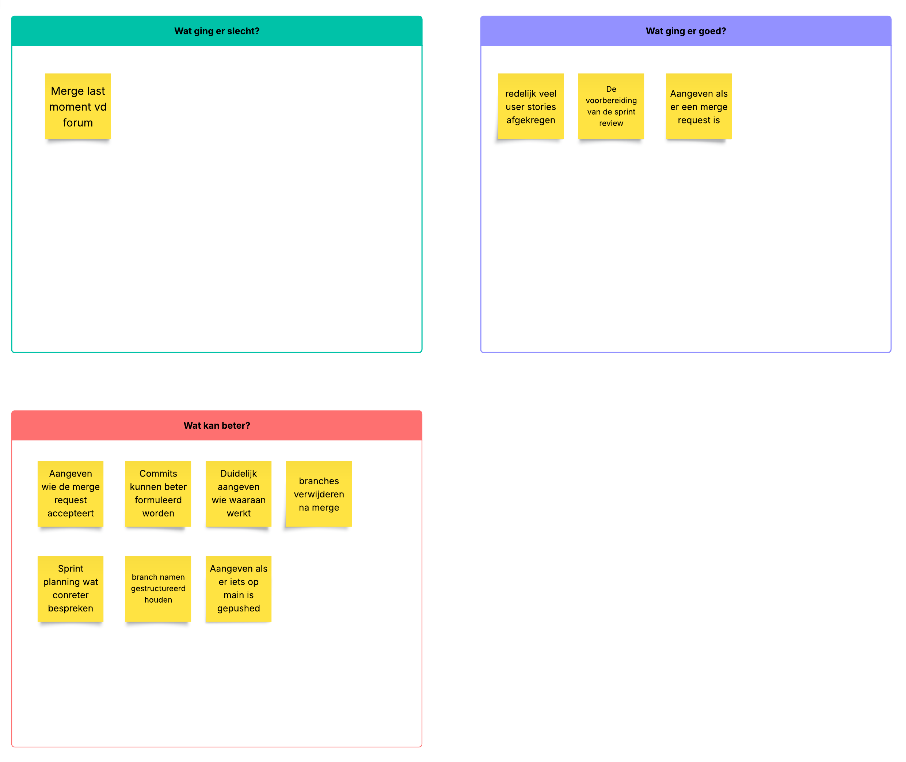

# Retrospectives

## Sprint 3

_Datum: 6-11-2025_

### Concrete verbeterpunten

- Als er een merge request is aangemaakt, wordt er duidelijk gereageerd hierop met wie de merge request gaat goed keuren.
- Branch namen gestrucutreerd hetzelfde houden "feat/naam"
    
### Teamleden aanwezig

- Niek
- Daan
- Nabil
- Afnaan
- Manal

## Sprint 2

_Datum: 9-10-2025_

### Concrete verbeterpunten

- De dinsdag avond van de sprint review week wordt er gemerged, zodat er nog tijd is om dingen recht te trekken als er iets stuk gaat
- Als er een merge request is aangemaakt, wordt er duidelijk gereageerd hierop met wie de merge request gaat goed keuren.

### Teamleden aanwezig

- Afnaan
- Daan
- Niek
- Manal
- Nabil

## Sprint 1

_Datum: 18-9-2025_

### Concrete verbeterpunten

- Samen er voor zitten om de taakverdeling duidelijk te maken aan het begin van de nieuwe sprint
- De gemaakte designs nalopen zodat alles klopt met wat de bedoeling daarvan is

### Teamleden aanwezig

- Afnaan
- Daan
- Niek
- Manal

### Feedback

| Naam   | Top 1                                  | Top 2                  | Tip 1                                                                    | Tip 2 |
|--------|----------------------------------------|------------------------|--------------------------------------------------------------------------| -- |
| Niek   | Neemt goed het voortouw                | Communiceerd duidelijk | Kan wat serieuzer zijn tijdens de les                                    | - |
| Afnaan | Altijd optijd                          | Je denkt actief mee    | Vraag door als iets niet helemaal helder is                              | - |
| Daan   | Komt met goede ideeën                  | Altijd optijd          | Probeer bij meningsverschillen de rust te behouden                       | - |
| Manal  | Maakt duidelijk als ze iets niet snapt | Vraagt actief om input | Wees duidelijk in wat je nodig hebt van anderen om je werk goed te doen. | - |

