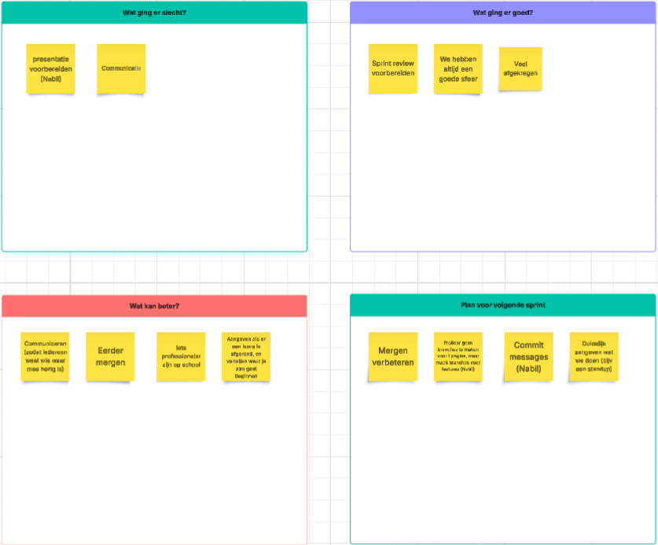

# Retrospectives

## Sprint 4

_Datum: 28-11-2025_

### Concrete verbeterpunten

#### SMART-doelen

| **Onderwerp**                  | **Situatie**                                                                                                                                    | **Doel**                                                                                                             | **Meetbaar**                                                                                                                             | **Acceptabel**                                                                             | **Realistisch**                                                        | **Tijdgebonden**                       |
|--------------------------------|-------------------------------------------------------------------------------------------------------------------------------------------------|----------------------------------------------------------------------------------------------------------------------|------------------------------------------------------------------------------------------------------------------------------------------|--------------------------------------------------------------------------------------------|------------------------------------------------------------------------|----------------------------------------|
| **Mergen verbeteren**          | Elke keer voor de sprint review wordt er in de avond ervoor nog heel veel grote dingen gemerged, wat risico’s geeft op fouten en instabiliteit. | Kleinere merge requests maken en iedereen main laten pullen naar zijn branch om grote merge conflicten te voorkomen. | Na elke merge naar main voert iedereen dezelfde dag een pull uit naar zijn/haar branch.                                                  | Vermindert risico op instabiliteit, verhoogt codekwaliteit en voorkomt last-minute stress. | Deze aanpak vereist alleen duidelijke communicatie, geen nieuwe tools. | Invoering vanaf **de volgende sprint** |
| **Branches per feature**       | Branches worden soms per pagina aangemaakt, wat zorgt voor onduidelijkheid en versnippering.                                                    | Branches structureren op features zodat werk logisch bij elkaar blijft.                                              | Branch structuur `feature/<omschrijving>`, bijvoorbeeld `feature/showing-profile-info`                                                   | Verhoogt overzicht, consistentie en maakt reviews makkelijker.                             | Is direct uitvoerbaar binnen huidige Git workflow.                     | Start vanaf **volgende feature**.      |
| **Commit messages verbeteren** | Commit messages zijn vaak te algemeen en daardoor moeilijk terug te begrijpen.                                                                  | Duidelijke commit-structuur hanteren zodat wijzigingen snel te begrijpen zijn.                                       | **90% van commits** volgt template: `<type>(<omschrijving): <methode> - <omschrijving>` (bijv. `feat(profile-info): add - profile API`). | Verbetert debugging en teamcommunicatie.                                                   | Iedereen kan gemakkelijk dezelfde structuur gebruiken                  | **2 weken** consistent toepassen       |
| **Daily standups starten**     | Er wordt geen vaste dagstart gehouden, waardoor onduidelijkheid ontstaat over voortgang en blokkades.                                           | Dagelijkse standups invoeren om teamcommunicatie en planning te verbeteren.                                          | Standup elke fysieke werkdag, max 10 minuten en volgens format: gisteren / vandaag / blockers                                            | Verhoogt transparantie, efficiëntie en vermindert miscommunicatie.                         | Lage tijdsinvestering, past binnen werkproces.                         | Start **komende fysieke werkdag**.     |

### Teamleden aanwezig

- Niek
- Daan
- Manal
- Nabil
- Afnaan

## Sprint 3

_Datum: 6-11-2025_

### Concrete verbeterpunten

- Als er een merge request is aangemaakt, wordt er duidelijk gereageerd hierop met wie de merge request gaat goed
  keuren.
- Branch namen gestrucutreerd hetzelfde houden "feat/naam"

### Teamleden aanwezig

- Niek
- Daan
- Nabil
- Afnaan
- Manal

## Sprint 2

_Datum: 9-10-2025_

### Concrete verbeterpunten

- De dinsdag avond van de sprint review week wordt er gemerged, zodat er nog tijd is om dingen recht te trekken als er
  iets stuk gaat
- Als er een merge request is aangemaakt, wordt er duidelijk gereageerd hierop met wie de merge request gaat goed
  keuren.

### Teamleden aanwezig

- Afnaan
- Daan
- Niek
- Manal
- Nabil

## Sprint 1

_Datum: 18-9-2025_

### Concrete verbeterpunten

- Samen er voor zitten om de taakverdeling duidelijk te maken aan het begin van de nieuwe sprint
- De gemaakte designs nalopen zodat alles klopt met wat de bedoeling daarvan is

### Teamleden aanwezig

- Afnaan
- Daan
- Niek
- Manal

### Feedback

| Naam   | Top 1                                  | Top 2                  | Tip 1                                                                    | Tip 2 |
|--------|----------------------------------------|------------------------|--------------------------------------------------------------------------|-------|
| Niek   | Neemt goed het voortouw                | Communiceerd duidelijk | Kan wat serieuzer zijn tijdens de les                                    | -     |
| Afnaan | Altijd optijd                          | Je denkt actief mee    | Vraag door als iets niet helemaal helder is                              | -     |
| Daan   | Komt met goede ideeën                  | Altijd optijd          | Probeer bij meningsverschillen de rust te behouden                       | -     |
| Manal  | Maakt duidelijk als ze iets niet snapt | Vraagt actief om input | Wees duidelijk in wat je nodig hebt van anderen om je werk goed te doen. | -     |

