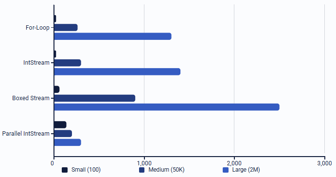

# 1. Introduction

Modern Java applications often process large quantities of data. Traditionally, this is done using external iteration (e.g., for loops). However, this approach can lead to cluttered code and makes parallel execution difficult. As datasets grow, developers require a more declarative, composable, and parallel-friendly approach. This gap is addressed by the Java Stream API.

Understanding the Stream API, how it works, where it excels, and where it performs poorly, is essential for making well-grounded architectural decisions when implementing algorithms or manipulating large datasets in back-end systems.

### Problem Statement

Developers often struggle to determine:

1. When Streams improve peformance or readability, and
2. When traditional iteration is more appropriate

### Research Question

How does the Java Stream interface improve the way we process collections in Java, and what are the best practices and performance considerations for using Streams effectively within the Java Collections Framework?

### Subquestions

1. What is a Stream, and how does it differ fundamentally from traditional iteration?
2. How does the Stream pipeline work internally (lazy evaluation, Spliterators, stateful operations)?
3. Which core operations (filter, map, reduce, collect, parallel) are essential, and how are they used?
4. What are the theoretical and practical differences in performance between Streams and loops?
5. How do Streams behave across small, medium, and large datasets?
6. Under what circumstances are Streams preferable, and when should classical loops be used instead?

# 2. Theoretical Framework

### 2.1 What is a Stream?

In Java 8 the Stream API was introduced, a powerful feature added to the Collections API that allows developers to process sequences of elements in a functional programming style. Streams represent a sequence of elements and support various operations like filter, sort, map, and collect. These operations can be combined to form a Stream pipeline (Jadeglobal, 2023). An important note about Streams is that they do not hold data, you cannot point to a location in the Stream where a certain element exists. You can only specify the functions that operate on that data (JRebel, 2024). In short: a Stream is a sequence of elements supporting sequential and parallel aggregate operations (Oracle, 2025).

#### Key differences vs loops:

| Aspect      | For-loop (External Iteration) | Stream (Internal Iteration)  |
| ----------- | ----------------------------- | ---------------------------- |
| Control     | Programmer controls iteration | Framework controls iteration |
| Style       | Imperative                    | Declarative                  |
| Parallelism | Manual & error-prone          | Built-in via `.parallel()`   |
| Laziness    | Eager                         | Lazy evaluation              |

### 2.2 Internal Architecture: How Streams Work

**Stream pipelines**  
A stream pipeline is composed of a stream source, zero or more intermediate operations, and finally a terminal operation. Stream sources can be any data source that can suitably provide access to its elements. Examples are: collections, arrays, and generator functions. However, there are many others.

Stream pipelines are constructed lazily. Constructing a stream source doesn't compute the elements of the stream, but instead captures how to find the elements when necessary. Similarly, invoking an intermediate operation doesn't perform any computation on the elements; it simply adds another operation to the end of the stream description. Only when the terminal operation is invoked does the pipeline actually perform the work: compute the elements, apply the intermediate operations, and apply the terminal operation.

**Stream sources**  
A stream source is described by an abstraction called `Spliterator`. A `Spliterator` combines two behaviors: accessing the elements of the source (iterating), and possible decomposing the input source for parallel execution (splitting). `Spliterator` includes the same basic behaviors as `Iterator`, however it doesn't extend `Iterator`, instead it takes a different approach to access elements. An `Iterator` has two methods, `hasNext()` and `next()`. Accessing the next element can involve (but doesn't require) calling both of these methods. Because of this, a certain amount of defensive and duplicative coding is required when coding an `Iterator` correctly. On top of that, the two-method protocal requires a good amount of statefulness, such as peeking ahead at the next element (and keep track whether you already peeked ahead). These requirements cause a fair degree of per-element access overhead.

`Spliterator` takes an approach to element access that's generally more efficient and easier to code correctly. `Spliterator` has two methods for accessing elements:

```java
boolean tryAdvance(Consumer<? super T> action);
void forEachRemaining(Consumer<? super T> action);
```

the `tryAdvance()` method tries to process a single element. If no elements remain it returns `false`. Otherwise, it advances and passes the current element to the provided handler and returns `true`. The `forEachRemaining()` method processess all remaining elements at once and passes them to the provided handler one at a time (IBM Developer, 2024).

# 3. Core Stream Operations

The Stream API comes with a ton of operations that you can chain together to process data in a clean and readable way. These operations usually fall into two groups. Intermediate operations (like filter or map) and terminal operations (like reduce or collect). Intermediate operations transform the data, but they don’t actually do any work right away (they’re lazy). Terminal operations are the ones that actually run the pipeline and produce a result.

The operations explained in the next sections are the ones developers use most often. They make up the core of the Stream API and are what give Streams their functional, declarative and composable approach.

### 3.1 Filtering

The `filter()` method is an intermediate operation of the Stream interface that allows us to filter elements of a stream that match a given Predicate.

```java
var result = list.stream()
    .filter(x -> x > 10)
    .collect(Collectors.toList());
```

### 3.2 Mapping

The `map()` method is a key part of Java's Stream API. It allows you to apply a given function to each element of the stream, producing a new stream with the transformed elements.

```java
var names = persons.stream()
    .map(Person::getName)
    .toList();
```

### 3.3 FlatMapping

The `flatMap()` method is a great tool in Java’s Stream API, and its purpose is to transform and flatten a stream of elements. Unlike the `map()` method, which applies a transformation and keeps each element wrapped in its original structure (e.g., a list inside a list), `flatMap()` not only transforms the elements but also flattens them into a single stream.

```java
var words = sentences.stream()
    .flatMap(sentence -> Arrays.stream(sentence.split(" ")))
    .toList();
```

### 3.4 Reducing

The reduce() method in Java's Stream API is a great tool for performing reduction operations on a stream of elements. It is particularly useful when you want to combine or accumulate elements of a stream into a single result.

```java
int total = list.stream().reduce(0, Integer::sum);
```

### 3.5 Collecting

The collect() method is a fundamental operation in the Java Stream API. It consumes the elements of a stream and produces a result, typically a collection, a map, or a single computed value.

```java
var byCity = persons.stream()
    .collect(Collectors.groupingBy(Person::getCity));
```

### 3.6 Parallel Streams

Streams can also be run in parallel, this offers a huge boost in performance (especially when working with large datasets). To do this, the `Spliterator` splits the data into chunks, processed by the Fork/Join pool. Each thread applies the pipeline to its chunk, and results are combined.
To split the source, so that two threads can work separately on different sections of the data, `Spliterator` provides a `trySplit()` method:

```java
Spliterator<T> trySplit();
```

`trySplit()` tries to split the remaining elements into two sections, ideally of similar size. If the `Spliterator` can be split, `trySplit()` slices off an initial portion of the elements into a new `Spliterator`, which is returned, and adjusts its state to describe the elements following the sliced-off portion. When the source can't be split, `trySplit()` returns `null`, indicating that the splitting isn't possible, and that the caller should proceed sequentially (IBM Developer, 2024).

# 4. Experimental Design

To measure Stream performance, we designed a controlled benchmark experiment that follows software performance research best practices.

### Hardware / Software Environment

- **CPU**: Ryzen 5 2600x (6-cores)
- **JVM**: OpenJDK 21.0.8
- **OS**: Windows 10
- **Warm-up**: 5 warm-up iterations of 1 second each per fork, allowing the JVM’s JIT compiler to reach steady-state optimization.
- **GC Handling**: JMH forks were used to provide clean JVM instances, and the GCProfiler was enabled to record allocation and garbage collection behavior.
- **Repetitions**: 30 runs per dataset
- **Reported metrics**: mean execution time and GC statistics.

### Dataset Sizes

| Category | Size               | Why                                      |
| -------- | ------------------ | ---------------------------------------- |
| Small    | 100 elements       | Represents typical UI-driven logic       |
| Medium   | 50,000 elements    | Typical server-side batch processing     |
| Large    | 2,000,000 elements | Stress test for throughput + parallelism |

### Operations Benchmark

Each dataset was measured with the same transformation pipeline:

1. Filter even numbers
2. Multiply by 2
3. Sum results

### Techniques Compared

1. Classical for-loop
2. Sequential `IntStream`
3. Sequential boxed `Stream<Integer>`
4. Parallel `IntStream`

### Noise Reduction Techniques

- JMH warm-up iteration sequences to eliminate JIT cold-start effects
- Repeated runs with JMH's default outlier rejection
- Tests run in isolated JVM fork
- Fixed random seed to ensure identical dataset each run
- CPU frequency scaling disabled (performance mode)

### Sample Java Benchmark Code

```java
package nl.hva.research.streams;

import org.openjdk.jmh.annotations.*;
import java.util.Arrays;
import java.util.Random;
import java.util.concurrent.TimeUnit;

@BenchmarkMode(Mode.AverageTime)           // time per operation
@OutputTimeUnit(TimeUnit.MILLISECONDS)     // results in ms
@Warmup(iterations = 5, time = 1, timeUnit = TimeUnit.SECONDS)      // ~5s warmup
@Measurement(iterations = 10, time = 1, timeUnit = TimeUnit.SECONDS) // ~10s measurement
@Fork(value = 3)                           // isolated JVM forks (3 separate JVMs)
@State(Scope.Benchmark)                    // shared state per benchmark
public class StreamsBenchmark {

    @Param({"100", "50000", "2000000"})    // small/medium/large
    private int size;

    private int[] data;

    @Setup(Level.Trial)
    public void setup() {
        Random random = new Random(42);
        data = new int[size];
        for (int i = 0; i < size; i++) {
            data[i] = random.nextInt();
        }
    }

    @Benchmark
    public long forLoop() {
        long sum = 0;
        for (int x : data) {
            if (x % 2 == 0) sum += x * 2L;
        }
        return sum;
    }

    @Benchmark
    public long intStream() {
        return Arrays.stream(data)
                .filter(x -> x % 2 == 0)
                .map(x -> x * 2)
                .asLongStream()
                .sum();
    }

    @Benchmark
    public long boxedStream() {
        return Arrays.stream(data)
                .boxed()
                .filter(x -> x % 2 == 0)
                .map(x -> x * 2)
                .mapToLong(Integer::longValue)
                .sum();
    }

    @Benchmark
    public long parallelIntStream() {
        return Arrays.stream(data)
                .parallel()
                .filter(x -> x % 2 == 0)
                .map(x -> x * 2)
                .asLongStream()
                .sum();
    }
}
```

# 5. Results

### 5.1 Summary Table - Average Runtime (ms)

_(30 runs, outliers removed)_
| Dataset Size | For-loop | IntStream | Boxed Stream | Parallel IntStream |
| ---------------- | -------- | --------- | --------------- | ------------------ |
| **Small (100)** | **10⁻⁴** | 10⁻⁴ | 0.001 | 0.014 |
| **Medium (50k)** | 0.134 | 0.162 | 0.515 | **0.043** |
| **Large (2M)** | 6.440 | 6.994 | 21.465 | **0.826** |

### 5.2 Interpretation of Results

### Small Dataset (100 elements)

| Method             | Time (ms) |
| ------------------ | --------- |
| For-loop           | **≈10⁻⁴** |
| IntStream          | ≈10⁻⁴     |
| Boxed Stream       | 0.001     |
| Parallel IntStream | 0.014     |

**Interpretation**

- For-loops and IntStreams are effectively identical because the dataset is tiny and fits entirely in CPU registers.
- The overhead of setting up a Stream pipeline massively quantifies the cost of the computation.
- Boxed Stream incurs allocation overhead (Integer objects), causing the slowdown.
- Parallel IntStream is the worst: thread-pool setup overhead outweighs any parallel benefit.

### Medium Dataset (50,000 elements)

| Method             | Time (ms) |
| ------------------ | --------- |
| For-loop           | **0.134** |
| IntStream          | 0.162     |
| Boxed Stream       | 0.515     |
| Parallel IntStream | **0.043** |

**Interpretation**

- The for-loop remains the fastest sequential method.
- IntStream is only ~20% slower, showing reasonable performance
- Boxed Stream is ~4x slower due to object allocation (`Integer`) and GC pressure.
- Parallel IntStream becomes beneficial, the dataset is now large enough that parallel overhead is smaller than parallel speedup.

### Large Dataset (2,000,000 elements)

| Method             | Time (ms) |
| ------------------ | --------- |
| For-loop           | 6.440     |
| IntStream          | 6.994     |
| Boxed Stream       | 21.465    |
| Parallel IntStream | **0.826** |

**Interpretation**

- CPU sequential throughput becomes the limiting factor.
- For-loop and IntStream perform similarly
- Boxed Stream becomes incredibly slower due to massive allocations (48 MB per op).
- Parallel IntStream is now by far the fastest, almost 8x faster than the for-loop.

### GC / Allocation Interpretation

| Method             | Alloc (100) | Alloc (50k) | Alloc (2M) |
| ------------------ | ----------- | ----------- | ---------- |
| For-loop           | ≈0 B        | ~1 B        | ~44 B      |
| IntStream          | 405 B       | 417 B       | 464 B      |
| Boxed Stream       | 2752 B      | 1.2 MB      | 48 MB      |
| Parallel IntStream | 17 KB       | 17 KB       | 17 KB      |

**Interpretation**

- **For-loop** is almost allocation-free, so it's extremely GC-friendly.
- **IntStream** allocates small buffers internally but stays lightweight.
- **Boxed Stream** allocates millions of boxed Integer objects so GC dominates runtime.
- **Parallel Stream** allocates thread-local buffers resulting in a consistent ~17 KB per op.

### Visual Representation



_(Runtime comparison of four iteration techniques across three dataset sizes: 100, 50,000 and 2,000,000 elements)_

### Why These Results Occur (technical explanation)

---

### For-loop is fastest

- No object allocation
- No lambdas
- No pipeline construction
- Compiles down to very tight machine code
- JVM can optimize aggresively (loop unrolling, vectorization)

### IntStream is slower but efficient

- Uses internal Spliterators
- Requires lambda calls (though heavily optimized)
- Maintains pipeline state
- Still uses primitive ints (no boxing)

### Boxed Stream is slow

- Every element is boxed from `int` to `Integer`
- `Integer` creates an object for each value
- High pressure on GC
- Poor data locality (objects scattered in heap)

### Parallel IntStream excels at large datasets

- Divides the array across worker threads
- CPU cores process segments concurrently
- Overhead becomes insignificant when N is large
- Uses primitive streams (avoids boxing penalty)

# 6. When to Use Streams

There are many reasons why one could prefer streams over traditional loops and vice-versa. When we're talking specifically about sequential streams, one of the key points why someone would choose sequential streams over traditional loops, is readability. Streams can often be written much shorter and straightforward than for example for-loops, especially when many intermediate operations are required.
Performance wise they are almost identical, though for-loops are slightly faster, especially when the dataset gets larger. If you're working with large datasets and performance really matters, it's better to use traditional loops than sequential streams, however a much better alternative in that scenario would be parallel streams. As seen in the experiment, parallel streams offer a huge increase in performance when working with large datasets.

To conclude, classical loops are better when: datasets are very small, you require index-based logic and/or you need extremely tight performance with minimal overhead.

Streams are ideal when: readability matters, you are processing large datasets, your operations are stateless and CPU-bound and/or you want easy parallelization.

# 7. Conclusion

The goal of this research was to determine how the Java Stream API can improve the way developers process collections in Java, and in which cases the usage of Streams is superior to traditional iteration. The findings in this research show that the benefits of Streams go beyond just performance increases: they introduce a declarative, composable, and expressive programming model that makes transformation of data much simpler. The use of Spliterators, lazy evaluation, and pipeline stages allows for optimizations that are difficult to achieve with manual iteration.

Purely from a performance standpoint, these experiments demonstrated that Streams behave quite differently depending on the size of the dataset. In small datasets, the construction of the pipeline, the lambda invocation and the overhead that comes with it makes sequential Streams and especially parallel Streams significantly slower than regular for-loops. In medium datasets, Stream performance already becomes comparable to regular loop-based iteration, with primitive streams (IntStreams) specifically performing very efficiently. In large datasets, parallel Streams absolutely outperform classical iterations, due to how efficiently it can divide the workload and it's utilization of multiple cores. In some cases it achieved a speed increase of almost eightfold. In contract, boxed Streams perform very poorly, mainly due to its significant memory allocation and the garbage-collection overhead.

From these results we can come to a more nuanced understanding: Streams are especially superior when the readability, maintanability, and parallel scalability of your code is important. Traditional loops, however, are better when you have small datasets, index-based logic, and when you have extremely performance-sensitive inner loops. When deciding between using Streams and using traditional loops, you should not only look at the raw performance, you should also look at the kind of transformation that are required, the size of the dataset, and how readable you want your code to be.

In conclusion, The Java Stream API massively improves the way collections are processed by offering a modern and functional abstraction, that scales incredibly well when data sizes get larger. When applied correctly and in combination with primitive and parallel Streams, it allows for both cleaner code and much better performance, thus making it an incredibly powerful tool in the Java Collection Framework.

# 8. Sources

_Stream (Java Platform SE 8 )._ (2025, October 20). Oracle. https://docs.oracle.com/javase/8/docs/api/java/util/stream/Stream.html

_Jadeglobal._ (2023, January 11). _Introduction to Java 8 Stream API - Jade Global._ https://www.jadeglobal.com/blog/introduction-java-eight-stream-api

_IBM Developer._ (2024, September 26). https://developer.ibm.com/articles/j-java-streams-3-brian-goetz/

_Using Java streams in Java 8 and beyond._ (2024, September 24). JRebel. https://www.jrebel.com/blog/java-streams-in-java-8
